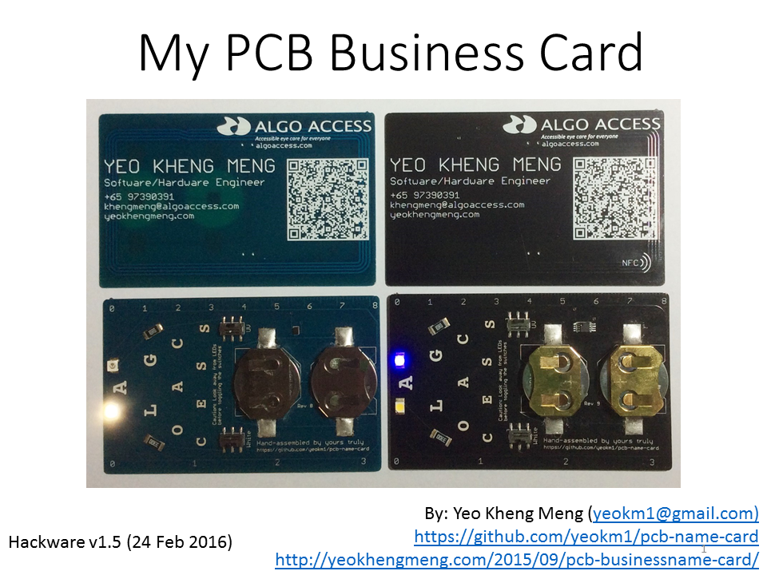
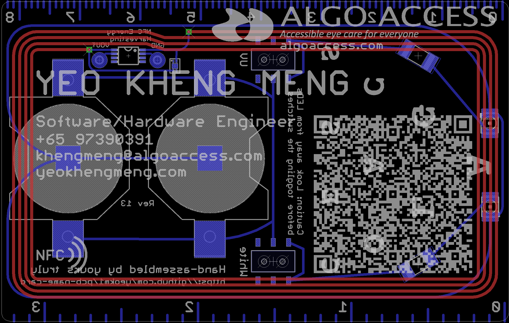
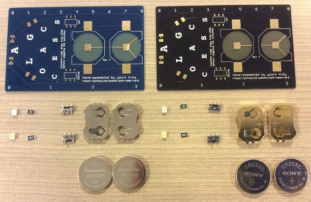

# pcb-name-card

My name or business card that is on a Printed Circuit Board (PCB). Comes with an white LED, UV LED and a ruler. Not forgetting a QR code containing my contact details in [Vcard](https://en.wikipedia.org/wiki/VCard) format.

###PCB Design software and addons/references used

1. Eagle 7.3.0: I use Standard but Light should still be able to open/modify the files.
2. Modified CR2032 library based on [here](https://github.com/nickaknudson/eagle-nickaknudson/blob/master/cr2032.lbr)
2. Elecrow Design Rule Check for 2 layers (in repo as `Elecrow_2-layer_eagle_rule.dru`)
3. Elecrow Gerber Generater 2-layer board (in repo as `Elecrow_Gerber_Generater_DrillAlign.cam`)
4. QR code generated from [here](http://goqr.me/)

###Schematic drawings

Images are exported from Eagle at 600dpi.

The board layout as seen in Eagle.

There is a dummy wire on the top layer around the QR code. This is to prevent PCB manufacturers from getting confused about my design if I specify a 2-layer order but only have the electrical areas at the bottom of the card. The dummy electrical wire on top "appeases" their requirement that I have electrical stuff on top and bottom.

The board schematic as seen in Eagle.

###Bill of Materials (BOM) for components only

  
Components in their raw form

Components still in their original packets from different suppliers.

Assume minimum order 10 pieces, cost in Singapore dollars. There are additional savings if I order more say 50 units but the savings are still small. Delivery for BOM not included.

The BOM is available in the odt spreadsheets in this repo.

###PCB fabrication

PCB fabrication is currently done by [Elecrow (10-pieces-link)](http://www.elecrow.com/10pcs-2-layer-pcb-p-1175.html) or [(50-pieces-link)](http://www.elecrow.com/50pcs-2-layer-pcb-enig-p-1172.html) based on the following settings. Remember to consult the order submission specifications at the bottom of the previous link before submitting. Use the provided Gerber generator to produce the Gerber files.

####My Fabrication Settings:

1. Layer: 2
2. PCB Thickness: 0.6mm
3. Copper Weight : 1oz 35um (NA for 50 pieces)
4. PCB Size : 10cm Max * 10cm Max (or 50cm2 for 50 pieces)
5. PCB Color : Blue or Black
6. Surface Finish: ENIG
7. PCB Stencil : NO Stencil
8. Lead time : Shipped in 4 to 7 days (NA for 50 pieces)
9. Panelizing : Single PCB with milling

###PCB Cost including delivery
Assume US$1 = SG$1.3

####Unit cost for 10 PCBs only
Total PCB Cost: US$30.80 + US$16.17 (DHL) = US$46.97  
Individual PCB Cost: (US$46.97 * 1.3) / 10 = SG$6.10  

####Unit cost for 50 PCBs only
Total PCB Cost: US$62.47 + US$18.81 (DHL) = US$81.28  
Individual PCB Cost: (US$81.28 * 1.3) / 50 = SG$2.11  

###Total Unit cost (SGD$) with components

| Pieces | Young Blue | Formal Black |
|--------|------------|--------------|
| 10 | $15.53 | $17.19 |
| 50 | $10.53 | $12.26 |

#References
1. [How to design a 13.56 MHz
customized tag antenna](http://www.st.com/st-web-ui/static/active/jp/resource/technical/document/application_note/CD00221490.pdf)
2. [The impact of high pulse drain on CR2032 coin-cell battery capacity](http://m.eet.com/media/1121454/c0924post.pdf)
3. [Panasonic NFC Design Navigator](http://www.semicon.panasonic.co.jp/en/tool/nfcdesignnavigator/)
